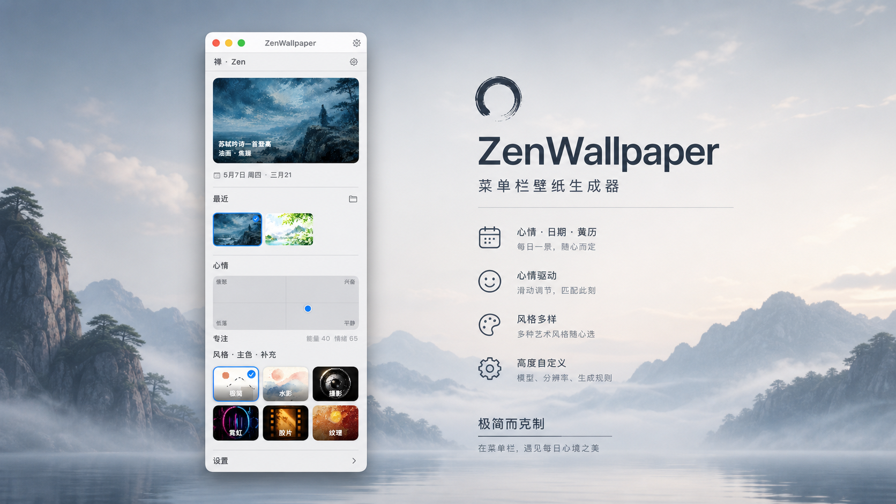
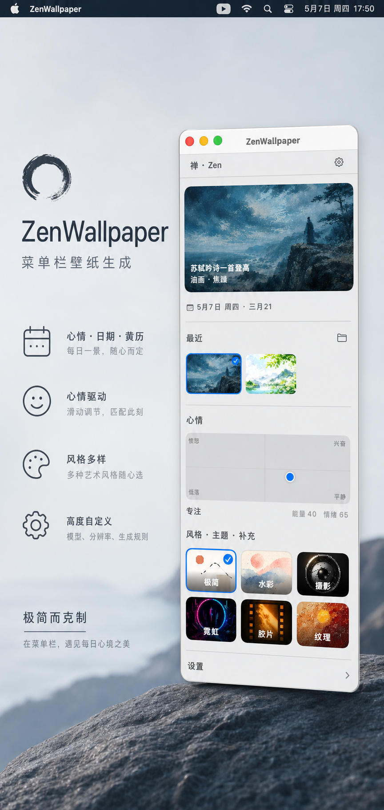
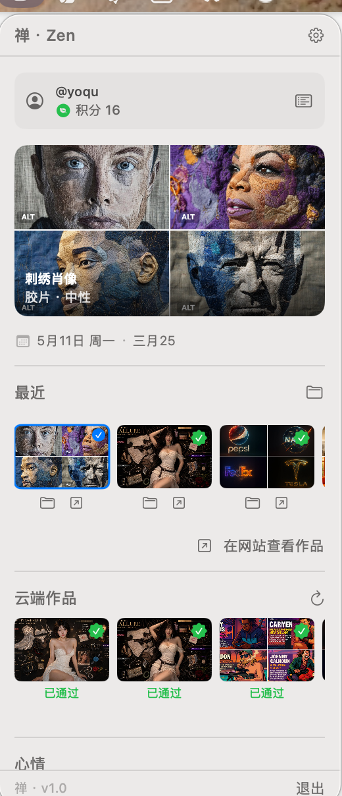
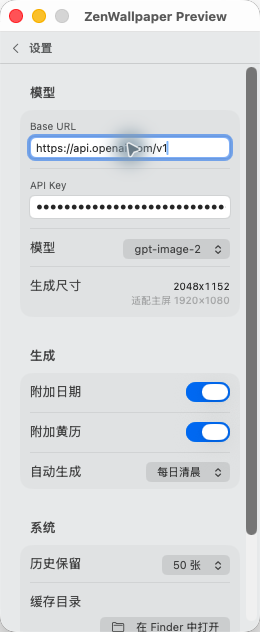

# ZenWallpaper

macOS 菜单栏壁纸生成器。把心情、日期、黄历、风格和补充提示词拼成 prompt，生成今日壁纸并自动应用到所有显示器。

## 海报宣传图




## 预览




## 特性

- 菜单栏常驻，随时生成今日壁纸
- 心情面板可同时调节能量与情绪
- 风格预设：极简、水彩、摄影、赛博朋克、胶片、油画
- 主色可快速切换，支持补充提示词
- 自动保存历史壁纸，可在 Finder 中查看或恢复
- 支持多显示器应用
- 支持本地化资源与缓存管理

## 联系与反馈

- 反馈意见请在 GitHub Issues 提交：[github.com/yoqu/ZenWallpaper/issues](https://github.com/yoqu/ZenWallpaper/issues)
- X / Twitter：[@LYoqu60097](https://x.com/LYoqu60097)
- 微信：`yoqu2020`

  

## 友链

- [linux.do](https://linux.do)

## 运行要求

- macOS 13 或更高
- Swift 5.9 / Xcode 15+ 或兼容工具链
- 可访问 OpenAI-compatible 图像生成接口

## 快速开始

```bash
swift build -c release
./build.sh
open ZenWallpaper.app
```

## 配置

首次打开后，在“设置”里填写：

- `Base URL`：默认 `https://api.openai.com/v1`
- `API Key`：你的接口密钥
- `模型`：`gpt-image-2`、`gpt-image-1` 或 `dall-e-3`

生成结果会保存到本机：

`~/Library/Application Support/ZenWallpaper/cache/`

历史记录索引位于：

`~/Library/Application Support/ZenWallpaper/history.json`

## 使用方式

1. 点击菜单栏图标打开面板
2. 调整心情、风格、主色和补充提示词
3. 点击“生成今日壁纸”
4. 生成完成后会自动应用到桌面，并保存到历史列表

## 项目结构

- `Sources/ZenWallpaper/` 主程序代码
- `Resources/` 图标、风格预设和本地化资源
- `docs/screenshots/` README 预览图
- `build.sh` 打包为 `.app` 和 `.dmg`
- `test_e2e.swift` 图像接口联调脚本

## 隐私说明

- API Key 仅保存在本机 `UserDefaults`
- 生成图片会落地到本机缓存目录
- 不会主动上传历史图片到第三方仓库

## 许可证

MIT
